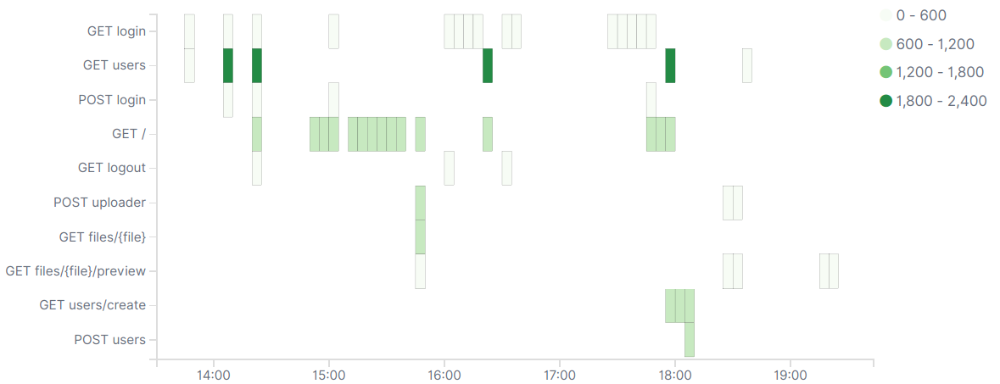

# pkeidel/laralog

[](https://packagist.org/packages/pkeidel/laralog)
[](https://packagist.org/packages/pkeidel/laralog)

This package is inspired by [laravel-debugbar](https://github.com/barryvdh/laravel-debugbar) and [clockwork](https://github.com/itsgoingd/clockwork)
but logs the data to an elasticsearch server. It registers a middleware and the HTTP request to elasticsearch is send within `terminate()` by default to not slow down your page.

It logs: response data (like response time and http status code), database queries, most fired events, custom data.  

## Installation

You can install the package via composer:

```bash
composer require pkeidel/laralog
```

## Log exceptions

Simply add this to `app/Exceptions/Handler::report(Exception $exception)`:

``` php
$pklaralog = resolve('pklaralog');

$pklaralog->get('errors')->push([
    'type'      => 'error',
    'time'      => round(microtime(true), 3),
    'exception' => get_class($exception),
    'message'   => $exception->getMessage(),
    'file'      => $exception->getFile(),
    'line'      => $exception->getLine(),
    'route'     => optional(request()->route())->uri() ?? 'unknown',
]);
```

## Example Kibana visualisations
### Requests per route


## License

The MIT License (MIT). Please see [License File](LICENSE) for more information.
